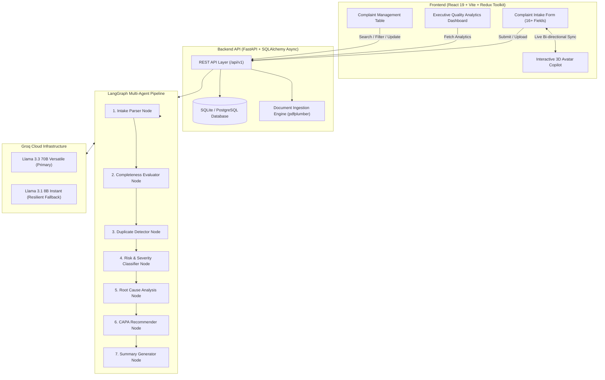
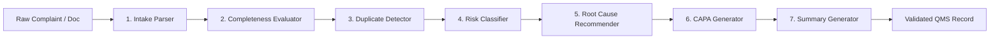

# 🏥 CUSTOMERai — AI-Powered Quality & Complaint Management System

> **Enterprise-grade Medical Device & Pharmaceutical Quality Management System (QMS) powered by LangGraph multi-agent intelligence, FastAPI, React 19, and Groq Cloud LLMs.**

[](https://fastapi.tiangolo.com)
[](https://react.dev)
[](https://vitejs.dev)
[](https://langchain-ai.github.io/langgraph/)
[](https://groq.com)
[](https://www.sqlalchemy.org)
[](https://opensource.org/licenses/MIT)

---

## 📑 Table of Contents

- [🌟 System Highlights](#-system-highlights)
- [🏗 Architecture & Workflow](#-architecture--workflow)
- [🤖 Multi-Agent Pipeline Nodes](#-multi-agent-pipeline-nodes)
- [🤖 Interactive 3D Copilot (CustomerHelperAI)](#-interactive-3d-copilot-customerhelperai)
- [📁 Project Layout](#-project-layout)
- [🛠 Tech Stack](#-tech-stack)
- [🚀 Quick Start Guide](#-quick-start-guide)
  - [Prerequisites](#prerequisites)
  - [1. Backend Setup](#1-backend-setup)
  - [2. Frontend Setup](#2-frontend-setup)
- [📡 API Endpoint Reference](#-api-endpoint-reference)
- [🧪 Testing & Verification](#-testing--verification)
- [📄 License](#-license)

---

## 🌟 System Highlights

- 🤖 **Interactive 3D Robot Copilot (`CustomerHelperAI`)**: Live conversational quality assistant with canvas-rendered thinking and talking states. Synchronizes bi-directionally in real-time across all 16+ complaint form fields.
- ⚡ **Autonomous 7-Stage LangGraph Multi-Agent Pipeline**: Ingests, validates, deduplicates, classifies risk, formulates root causes, drafts CAPAs, and generates executive summaries without human intervention.
- 📊 **Executive Quality Analytics Dashboard**: Real-time KPIs, severity breakdowns, product risk heatmaps, root cause distribution, and Mean Time to Resolution (MTTR).
- 🗂 **Advanced Complaint Management Portal**: Multi-column sorting, status filtering, live search, paginated records, and audit-ready detail drawers.
- 📄 **Multimodal Document Processing**: Automatic parsing and entity extraction for PDF, TXT, and EML attachments via `pdfplumber`.
- 🔄 **Multi-Model LLM Resilience**: Automatic dynamic failover between `llama-3.3-70b-versatile` (deep reasoning) and `llama-3.1-8b-instant` (high-throughput low-latency).

---

## 🏗 Architecture & Workflow



---

## 🤖 Multi-Agent Pipeline Nodes



1. **Intake Parser (`backend/app/agents/nodes/intake_parser.py`)**:
   - Parses unstructured customer narratives and uploaded PDF/TXT attachments.
   - Extracts structured entities: `product_name`, `lot_number`, `reported_defect`, `event_date`, `patient_impact`, etc.
2. **Completeness Evaluator (`backend/app/agents/nodes/completeness_checker.py`)**:
   - Evaluates mandatory regulatory fields.
   - Computes a `completeness_score` (0–100%) and returns targeted questions for missing information.
3. **Duplicate Detector (`backend/app/agents/nodes/duplicate_detector.py`)**:
   - Compares complaint against historical database records using TF-IDF and Cosine Vector Similarity.
   - Flags recurring lot defects and related batch issues with similarity confidence scores.
4. **Risk Classifier (`backend/app/agents/nodes/risk_classifier.py`)**:
   - Conducts FMEA risk analysis (Severity, Occurrence, Detection).
   - Categorizes risk (`Critical`, `Major`, `Minor`) and flags FDA 21 CFR 803 / EU MDR reportability.
5. **Root Cause Recommender (`backend/app/agents/nodes/root_cause_recommender.py`)**:
   - Formulates 5-Whys and Ishikawa (Fishbone) root cause hypotheses across Man, Machine, Material, Method, and Environment.
6. **CAPA Recommender (`backend/app/agents/nodes/capa_recommender.py`)**:
   - Generates targeted Corrective Actions (containment) and Preventive Actions (remediation).
   - Suggests responsible departments, owners, and SLA verification deadlines.
7. **Summary Generator (`backend/app/agents/nodes/summary_generator.py`)**:
   - Produces auditor-ready executive complaint summaries and regulatory disclosure narratives.

---

## 🤖 Interactive 3D Copilot (CustomerHelperAI)

- **Canvas-Rendered 3D Robot Avatar**: Smooth CSS & Canvas animations responding dynamically to `idle`, `thinking`, `speaking`, and `error` states.
- **Natural Language Parsing**: Paste messy emails, customer phone notes, or field engineer logs — the Copilot parses all 16 fields and fills the form in one click.
- **Bi-directional Live Sync**: Form edits reflect in Copilot context; Copilot suggestions auto-update form fields with user confirmation.

---

## 📁 Project Layout

```
customerAI/
├── README.md                           # Single Unified Project Documentation
├── .gitignore                          # Root ignore configuration
├── backend/                            # FastAPI + LangGraph Backend Service
│   ├── app/
│   │   ├── agents/                     # LangGraph state machine & 7 agent nodes
│   │   │   ├── nodes/                  # Individual agent implementations & tests
│   │   │   ├── graph.py                # Graph compilation and state flow
│   │   │   ├── llm.py                  # Groq client factory with automatic fallback
│   │   │   └── state.py                # AgentState TypedDict schema
│   │   ├── api/                        # REST Controllers (complaints, copilot, analytics)
│   │   ├── core/                       # Pydantic Settings & environment config
│   │   ├── db/                         # SQLAlchemy async engine & sessionmaker
│   │   ├── models/                     # Database models (Complaint, CAPA, RootCause, etc.)
│   │   ├── schemas/                    # Pydantic validation schemas
│   │   └── main.py                     # FastAPI entry point, CORS & lifespan handlers
│   ├── alembic/                        # Database migrations
│   ├── requirements.txt                # Backend Python dependencies
│   ├── test_runner.py                  # Verification test runner
│   └── verification_suite.py           # End-to-end test suite
├── frontend/                           # React 19 Frontend Web Application
│   ├── src/
│   │   ├── api/                        # RTK Query API slices & base query
│   │   ├── app/                        # Redux store & hooks
│   │   ├── components/                 # Navbar, Toast, Shared UI elements
│   │   ├── features/
│   │   │   ├── complaints/             # Form, list views, detail drawer & slices
│   │   │   ├── copilot/                # 3D Robot Avatar, live chat, form sync
│   │   │   └── dashboard/              # Quality KPIs & Recharts analytics
│   │   ├── App.jsx                     # Route switching & view management
│   │   ├── main.jsx                    # React entrypoint
│   │   └── index.css                   # Global styles & design tokens
│   ├── package.json                    # Frontend dependencies
│   └── vite.config.js                  # Vite configuration
└── sample_data/                        # Sample complaint files (.pdf, .txt, .eml)
```

---

## 🛠 Tech Stack

### Frontend
- **Framework**: React 19 (`react`, `react-dom`)
- **Build Tool**: Vite 6
- **State Management**: Redux Toolkit & React-Redux (`@reduxjs/toolkit`, `react-redux`)
- **Visualizations**: Recharts
- **Icons**: Lucide React
- **Typography**: Inter (`@fontsource/inter`)
- **Linting**: Oxlint

### Backend
- **Framework**: FastAPI (v0.115.0) with Uvicorn
- **AI / Agents**: LangGraph (v0.2.28) + LangChain Core
- **LLM Provider**: Groq Cloud SDK (`llama-3.3-70b-versatile` & `llama-3.1-8b-instant`)
- **Database & ORM**: SQLAlchemy 2.0 Async + SQLite (`aiosqlite`) / PostgreSQL (`asyncpg`)
- **Document Processing**: `pdfplumber`, `aiofiles`
- **Machine Learning**: `scikit-learn`, `numpy`

---

## 🚀 Quick Start Guide

### Prerequisites
- **Node.js** ≥ 18.x
- **Python** ≥ 3.11
- **Groq API Key** (Free tier available at [console.groq.com](https://console.groq.com))

---

### 1. Backend Setup

```bash
# 1. Navigate to backend directory
cd backend

# 2. Create and activate a virtual environment
python -m venv .venv

# On Windows:
.venv\Scripts\activate
# On Linux/macOS:
source .venv/bin/activate

# 3. Install dependencies
pip install -r requirements.txt

# 4. Setup environment file
copy .env.example .env      # Windows
# or: cp .env.example .env  # Linux/macOS
```

Ensure `backend/.env` contains your settings:
```env
DATABASE_URL=sqlite+aiosqlite:///./complaints.db
GROQ_API_KEY=your_groq_api_key_here
GROQ_MODEL=llama-3.3-70b-versatile
GROQ_FALLBACK_MODEL=llama-3.1-8b-instant
ENVIRONMENT=development
CORS_ORIGINS=["http://localhost:5173","http://localhost:3000"]
```

```bash
# 5. Start the backend server
uvicorn app.main:app --reload --port 8000
```
- **API Documentation (Swagger)**: [http://localhost:8000/docs](http://localhost:8000/docs)
- **API Documentation (ReDoc)**: [http://localhost:8000/redoc](http://localhost:8000/redoc)

---

### 2. Frontend Setup

```bash
# 1. In a separate terminal, navigate to frontend directory
cd frontend

# 2. Install Node dependencies
npm install

# 3. Setup environment file
copy .env.example .env      # Windows
# or: cp .env.example .env  # Linux/macOS
```

Ensure `frontend/.env` contains:
```env
VITE_API_BASE_URL=http://localhost:8000
```

```bash
# 4. Start Vite development server
npm run dev
```
- **Web Application**: [http://localhost:5173](http://localhost:5173)

---

## 📡 API Endpoint Reference

| Method | Endpoint | Description |
|---|---|---|
| `POST` | `/api/v1/complaints/` | Ingest complaint and trigger 7-step LangGraph agent triage |
| `GET` | `/api/v1/complaints/` | List complaints with search, pagination, and multi-column filters |
| `GET` | `/api/v1/complaints/{id}` | Get complete complaint details with AI assessment, root cause & CAPAs |
| `PATCH` | `/api/v1/complaints/{id}` | Partially update complaint fields or status lifecycle |
| `POST` | `/api/v1/copilot/chat` | Conversational QA and real-time form assistance |
| `POST` | `/api/v1/copilot/extract-fields` | Extract structured form entities from raw customer narratives |
| `POST` | `/api/v1/copilot/suggest-improvements` | Generate recommendations to improve intake quality score |
| `GET` | `/api/v1/analytics/summary` | Aggregate KPI statistics for Executive Quality Dashboard |
| `POST` | `/api/v1/documents/upload` | Multipart file upload and automatic text extraction (PDF / TXT) |

---

## 🧪 Testing & Verification

Run all backend unit tests for agent nodes:
```bash
cd backend
pytest app/agents/nodes/ -v
```

Run comprehensive end-to-end test suite:
```bash
cd backend
python test_runner.py
```

Run frontend build check and linting:
```bash
cd frontend
npm run build
```

---

## 📄 License

This project is licensed under the MIT License — see the [LICENSE](LICENSE) file for details.
