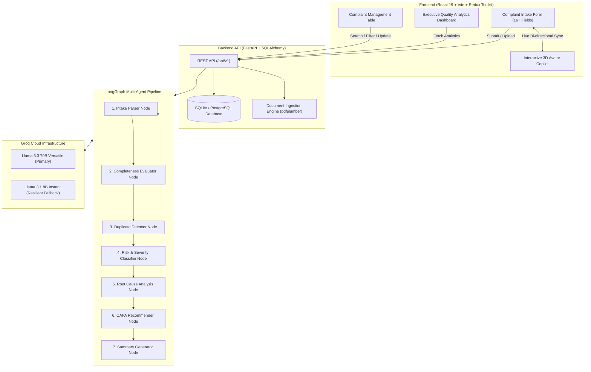

# 🏥 CUSTOMERai — AI-Powered Quality & Complaint Management System

> **Enterprise-grade Medical & Pharmaceutical Quality Management System (QMS) powered by LangGraph multi-agent intelligence, FastAPI, React 19, and Groq LLMs.**

[](https://fastapi.tiangolo.com)
[](https://react.dev)
[](https://vitejs.dev)
[](https://langchain-ai.github.io/langgraph/)
[](https://groq.com)
[](https://www.sqlalchemy.org)

---

## 🌟 Key Capabilities

- 🤖 **Interactive 3D Robot Copilot (`CustomerHelperAI`)**: Real-time conversational agent with animated thinking and talking states, capable of bi-directional synchronization with all 16+ complaint form fields.
- ⚡ **Autonomous 7-Stage LangGraph Agent Pipeline**:
  1. **Intake Parser**: Extracts structured metadata from unstructured text or uploaded documents (PDF, TXT, EML).
  2. **Completeness Evaluator**: Dynamically scores intake completeness and highlights missing critical data.
  3. **Duplicate & Similarity Detector**: Vector-based cosine similarity to identify related batches or recurring defects.
  4. **Risk & Severity Classifier**: Categorizes risk matrix levels, criticality, and FDA/MDR regulatory reportability.
  5. **Root Cause Recommender**: Formulates Ishikawa (Fishbone) and 5-Whys root cause hypotheses.
  6. **CAPA Action Generator**: Auto-generates targeted Corrective & Preventive Action plans with assignees and SLAs.
  7. **Executive QMS Summarizer**: Drafts formal complaint summaries and standardized regulatory disclosures.
- 📊 **Executive Quality Analytics Dashboard**: Real-time tracking of complaint volumes, severity distributions, product risk heatmaps, status lifecycles, and Mean Time to Resolution (MTTR).
- 🗂 **Advanced Complaint Management Portal**: Multi-column filtering, search, pagination, status lifecycle transitions, and document attachments.
- 🔄 **Multi-Model LLM Resilience**: Dynamic failover mechanism between high-reasoning models (`llama-3.3-70b-versatile`) and high-throughput low-latency fallbacks (`llama-3.1-8b-instant`).

---

## 🏗 System Architecture



---

## 📁 Repository Structure

```
customerAI/
├── README.md                           # Main Project Overview & Architecture
├── .gitignore                          # Repository-level ignore rules
└── complaint-mgmt-system/
    ├── README.md                       # Subsystem Technical Documentation
    ├── frontend/                       # React 19 Frontend Web Application
    │   ├── src/
    │   │   ├── api/                    # RTK Query API endpoints & base queries
    │   │   ├── app/                    # Redux store configuration
    │   │   ├── components/             # Reusable UI & 3D Copilot Avatar components
    │   │   └── features/
    │   │       ├── complaints/         # Intake form & list views
    │   │       ├── copilot/            # Live chat, suggestions & form synchronization
    │   │       └── dashboard/          # Analytics metrics & Recharts visualizations
    │   ├── package.json
    │   └── vite.config.js
    ├── backend/                        # FastAPI Backend Application
    │   ├── app/
    │   │   ├── agents/                 # LangGraph state machine & 7 agent nodes
    │   │   ├── api/                    # Route controllers (complaints, copilot, analytics)
    │   │   ├── core/                   # App configuration & settings
    │   │   ├── db/                     # SQLAlchemy async database session & engine
    │   │   ├── models/                 # ORM models (Complaints, CAPA, RootCause, etc.)
    │   │   ├── schemas/                # Pydantic validation models
    │   │   └── main.py                 # FastAPI application factory & middleware
    │   ├── alembic/                    # Database migrations
    │   └── requirements.txt
    └── sample_data/                    # Standardized test complaints (.pdf, .txt, .eml)
```

---

## 🚀 Quick Start Guide

### Prerequisites
- **Node.js** ≥ 18.x
- **Python** ≥ 3.11
- **Groq API Key** (Get free at [console.groq.com](https://console.groq.com))

---

### 1. Backend Setup

```bash
# Navigate to backend directory
cd complaint-mgmt-system/backend

# Create and activate virtual environment
python -m venv .venv
# On Windows:
.venv\Scripts\activate
# On macOS/Linux:
source .venv/bin/activate

# Install dependencies
pip install -r requirements.txt

# Configure environment variables
cp .env.example .env
```

Ensure your `.env` contains:
```env
DATABASE_URL=sqlite+aiosqlite:///./complaints.db
GROQ_API_KEY=your_groq_api_key_here
GROQ_MODEL=llama-3.3-70b-versatile
GROQ_FALLBACK_MODEL=llama-3.1-8b-instant
ENVIRONMENT=development
```

Start the FastAPI server:
```bash
uvicorn app.main:app --reload --port 8000
```
API Documentation will be live at: `http://localhost:8000/docs`

---

### 2. Frontend Setup

```bash
# In a separate terminal, navigate to frontend directory
cd complaint-mgmt-system/frontend

# Install dependencies
npm install

# Configure environment variables
cp .env.example .env
```

Ensure your `frontend/.env` contains:
```env
VITE_API_BASE_URL=http://localhost:8000
```

Start the Vite development server:
```bash
npm run dev
```
Open your browser at: `http://localhost:5173`

---

## 📡 API Endpoint Overview

| Method | Endpoint | Description |
|---|---|---|
| `POST` | `/api/v1/complaints/` | Submit a new complaint and trigger AI triage |
| `GET` | `/api/v1/complaints/` | List complaints with search, pagination & filters |
| `GET` | `/api/v1/complaints/{id}` | Retrieve comprehensive complaint details |
| `PATCH` | `/api/v1/complaints/{id}` | Partial update of complaint fields |
| `POST` | `/api/v1/copilot/chat` | Chat with CustomerHelperAI copilot |
| `POST` | `/api/v1/copilot/extract-fields` | Auto-extract form fields from raw input text |
| `POST` | `/api/v1/copilot/suggest-improvements` | Get AI recommendations for missing fields |
| `GET` | `/api/v1/analytics/summary` | Aggregate KPI statistics for Quality Dashboard |
| `POST` | `/api/v1/documents/upload` | Ingest and parse PDF/TXT complaint attachments |

---

## 🧪 Testing & Verification

Run backend unit and agent verification test suite:
```bash
cd complaint-mgmt-system/backend
pytest app/agents/nodes/ -v
python test_runner.py
```

Run frontend build check & linting:
```bash
cd complaint-mgmt-system/frontend
npm run build
```

---

## 🛡 License

This project is licensed under the MIT License.
