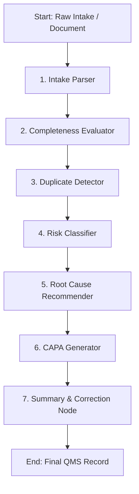

# 🏥 Complaint Management System (CustomerHelperAI)

> **Autonomous multi-agent platform for medical device & pharmaceutical complaint triage, risk classification, root cause analysis, and regulatory compliance.**

---

## 📑 Table of Contents

1. [Architecture Overview](#-architecture-overview)
2. [Multi-Agent Pipeline Nodes](#-multi-agent-pipeline-nodes)
3. [Interactive Copilot Assistant](#-interactive-copilot-assistant)
4. [Tech Stack Breakdown](#-tech-stack-breakdown)
5. [Database Schema & Models](#-database-schema--models)
6. [API Route Specifications](#-api-route-specifications)
7. [Installation & Setup](#-installation--setup)
8. [Testing & Quality Assurance](#-testing--quality-assurance)

---

## 🏛 Architecture Overview

The system is structured as a full-stack asynchronous platform integrating **FastAPI**, **LangGraph**, and **React 19**:

```
complaint-mgmt-system/
├── backend/
│   ├── app/
│   │   ├── agents/          # LangGraph state machine & node logic
│   │   │   ├── nodes/       # 7 core AI agent nodes + automated tests
│   │   │   ├── graph.py     # StateGraph wiring, edges, and compilation
│   │   │   ├── llm.py       # Groq client factory with automatic fallback
│   │   │   └── state.py     # TypedDict state schemas
│   │   ├── api/             # REST route handlers (Complaints, Copilot, Analytics, Docs)
│   │   ├── core/            # Configuration via pydantic-settings
│   │   ├── db/              # Async engine, sessionmaker, base model
│   │   ├── models/          # SQLAlchemy ORM models
│   │   ├── schemas/         # Pydantic validation schemas
│   │   └── main.py          # App initialization, CORS, lifespan handlers
│   ├── alembic/             # Database migration versions
│   └── requirements.txt     # Python dependencies
├── frontend/
│   ├── src/
│   │   ├── api/             # RTK Query client with axiosBaseQuery
│   │   ├── app/             # Redux Toolkit store configuration
│   │   ├── components/      # Reusable widgets & 3D Robot Avatar
│   │   ├── features/        # Feature domains (Complaints, Copilot, Dashboard)
│   │   └── App.jsx          # Dual-view routing & state sync
│   └── package.json         # Node.js dependencies
└── sample_data/             # Standard test cases (.pdf, .txt, .eml)
```

---

## 🤖 Multi-Agent Pipeline Nodes

When a complaint is ingested or submitted, the **LangGraph StateGraph** executes a 7-step sequential and conditional triage pipeline:



1. **Intake Parser (`intake_parser.py`)**:
   - Parses unstructured customer narratives and uploaded PDF/TXT attachments.
   - Extracts structured entities: `product_name`, `lot_number`, `reported_defect`, `event_date`, `patient_impact`, etc.
2. **Completeness Evaluator (`completeness_checker.py`)**:
   - Evaluates mandatory regulatory fields.
   - Calculates a `completeness_score` (0–100%) and returns actionable follow-up questions for missing details.
3. **Duplicate Detector (`duplicate_detector.py`)**:
   - Analyzes historical database records using TF-IDF and Cosine Vector Similarity.
   - Flags identical batch defects or recurring product complaints with similarity scores.
4. **Risk Classifier (`risk_classifier.py`)**:
   - Evaluates severity, probability, and detectability (FMEA).
   - Maps complaints to risk categories (`Critical`, `Major`, `Minor`) and determines FDA MDR / EU MDR reportability.
5. **Root Cause Recommender (`root_cause_recommender.py`)**:
   - Employs 5-Whys and Ishikawa (Fishbone) methodologies across Man, Machine, Material, Method, and Environment.
6. **CAPA Recommender (`capa_recommender.py`)**:
   - Generates concrete Corrective Actions (containment) and Preventive Actions (long-term remediation).
   - Proposes ownership assignments and target completion timelines.
7. **Summary Generator (`summary_generator.py`) & Field Correction (`field_correction.py`)**:
   - Synthesizes executive summaries for quality auditors and auto-corrects formatting inconsistencies.

---

## 🤖 Interactive Copilot Assistant

The frontend includes **CustomerHelperAI**, a 3D animated virtual quality assistant:
- **Bi-directional Form Sync**: Edits made in the chat reflect instantly in the 16-field intake form and vice versa.
- **Visual State Animations**: Features idle floating, active listening, thinking pulse, and talking mouth animations.
- **Natural Language Parsing**: Users can paste messy emails or voice notes, and the Copilot extracts and populates all form fields in one click.

---

## 🛠 Tech Stack Breakdown

### Frontend
- **Framework**: React 19 (`react`, `react-dom`)
- **Build Tooling**: Vite 6
- **State Management**: Redux Toolkit (`@reduxjs/toolkit`, `react-redux`)
- **Data Visualization**: Recharts
- **Icons**: Lucide React
- **Typography**: Inter via `@fontsource/inter`
- **Linting**: Oxlint

### Backend
- **Framework**: FastAPI (v0.115.0) with Uvicorn (v0.30.6)
- **Agent Framework**: LangGraph (v0.2.28) + LangChain Core
- **LLM Provider**: Groq Cloud SDK (Llama 3.3 70B & Llama 3.1 8B)
- **Database ORM**: SQLAlchemy 2.0 (Async) + aiosqlite / asyncpg
- **Document Processing**: `pdfplumber`, `aiofiles`
- **Similarity & ML**: `scikit-learn`, `numpy`

---

## 🗄 Database Schema & Models

- **`Complaint`**: Primary record containing complaint metadata, lot numbers, product details, status, severity, risk level, and reporter info.
- **`Assessment`**: AI-generated quality evaluations including completeness score, duplicate score, and regulatory flags.
- **`RootCause`**: 5-Whys breakdown, primary root cause category, and technical rationale.
- **`CAPA`**: Action plans, action type (`Corrective` vs `Preventive`), assigned department, status, and verification metrics.
- **`Document`**: File attachment storage path, MIME type, file size, and parsed plain text.

---

## 🔌 API Route Specifications

### Complaints API (`/api/v1/complaints`)
- `GET /` — List complaints with filters (`status`, `severity`, `product`, `search`, `page`, `page_size`)
- `POST /` — Ingest new complaint and trigger asynchronous LangGraph agent triage
- `GET /{id}` — Fetch detailed complaint record including AI assessments, root causes, and CAPAs
- `PATCH /{id}` — Update complaint status or field values

### Copilot API (`/api/v1/copilot`)
- `POST /chat` — Stream or execute conversational interactions with form-aware context
- `POST /extract-fields` — Extract structured JSON entities from natural text
- `POST /suggest-improvements` — Generate recommendations to improve complaint data quality

### Analytics API (`/api/v1/analytics`)
- `GET /summary` — Aggregate metrics: Total complaints, open investigations, high-risk items, MTTR, and trend distributions

### Document Ingestion API (`/api/v1/documents`)
- `POST /upload` — Multipart form upload supporting PDF, TXT, and EML documents

---

## 🚀 Installation & Setup

### 1. Environment Setup

#### Backend (`/backend/.env`)
```env
DATABASE_URL=sqlite+aiosqlite:///./complaints.db
GROQ_API_KEY=gsk_your_groq_api_key
GROQ_MODEL=llama-3.3-70b-versatile
GROQ_FALLBACK_MODEL=llama-3.1-8b-instant
ENVIRONMENT=development
CORS_ORIGINS=["http://localhost:5173","http://localhost:3000"]
```

#### Frontend (`/frontend/.env`)
```env
VITE_API_BASE_URL=http://localhost:8000
```

---

### 2. Launching Services

```bash
# Terminal 1 — Backend
cd backend
python -m venv .venv
.venv\Scripts\activate          # Windows (.venv/bin/activate on Unix)
pip install -r requirements.txt
uvicorn app.main:app --reload --port 8000
```

```bash
# Terminal 2 — Frontend
cd frontend
npm install
npm run dev
```

---

## 🧪 Testing & Quality Assurance

Run the test suite across all agent nodes:
```bash
cd backend
pytest app/agents/nodes/test_intake_parser.py -v
pytest app/agents/nodes/test_completeness_checker.py -v
pytest app/agents/nodes/test_duplicate_detector.py -v
pytest app/agents/nodes/test_risk_classifier.py -v
pytest app/agents/nodes/test_root_cause_capa.py -v
pytest app/agents/nodes/test_field_correction.py -v
```

Execute full system integration verification:
```bash
python verification_suite.py
```
